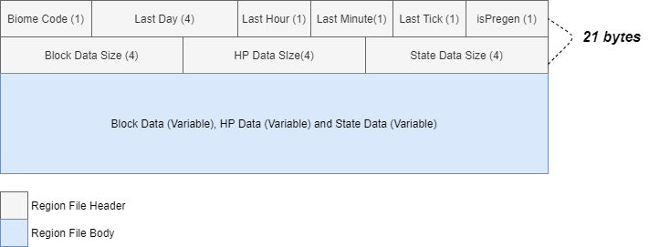
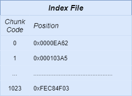
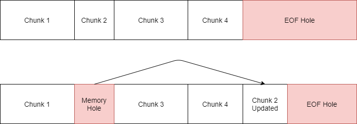
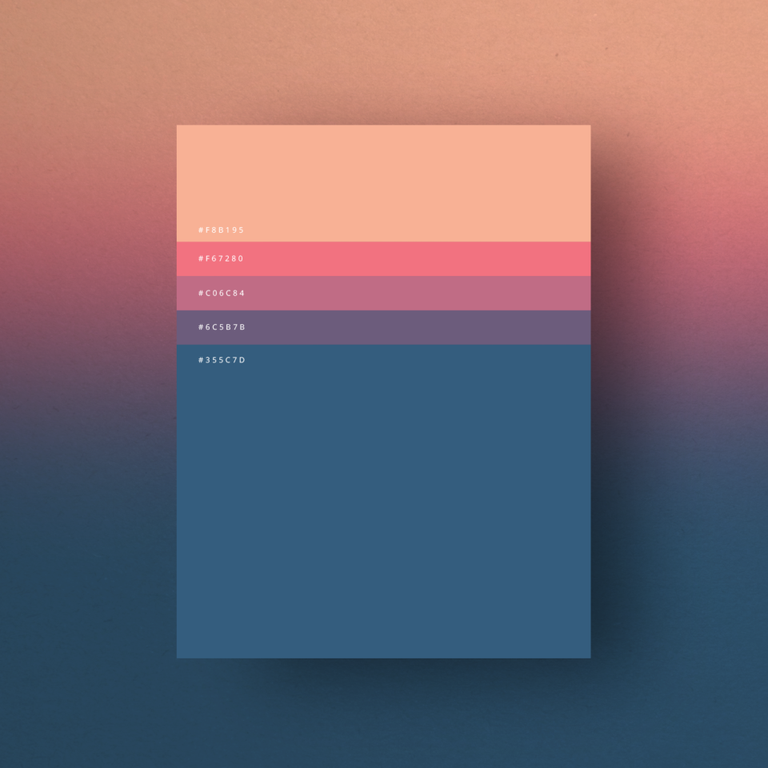

# World Saves

Interested in knowing how to the game saves your World and player data? Come with me, I'll show you.

## Regions and RegionFiles

We already defined a chunk as a 16x16 area that encompases all blocks in the Y axis. That's the sort of information we got to store in a file. Usually, if we save every single chunk we generate to the same file, it will get very big very quickly. Iterating over big files is a huge performance no no. In order to interate properly, without losing information or performance, we define a Region. **A Region is a 32x32 Chunk area**. Every Region should be able to take care of it's own chunks, thus, getting itself a brand unique file.

**The Region Data Files (.rdf)** is a file stored in the *World/(world_name)* folder. A world may have infinite .rdf files, each one associated to a quadrant region of the map. The structure of a .rdf file is as follows:

The first 21 bytes of every entry is a Header for a given chunk. The header has informations such as: chunk biome, last in-game time it was saved, flag that stores whether this chunk was pre-generated or not, and the sizes of the actual variable data inside the body.

As you can see, Chunk coordinates is not part of the data saved. So how will someone be able to load a specific chunk whenever the game needs it to? Simple, you don't. Not yet, I mean. Consider that we did add the chunk coordinates to the header of every chunk. To find the chunk you were looking for, you would have to read every header of the file, until you find the coordinates you were looking for. That's simply **way too slow!**

In order to do that correctly, we need a new type of file...

## Index File

An Index File (.ind) is a file that assigns a Chunk Code (8 bytes) to an Offset File Position (8 bytes). In a general case, every chunk in a region file gets an unique hash code (generated using Algebra tricks). The Offset File Position is the position of the .rdf file that the given chunk is stored.

In short, if you want to save a Chunk, we first generate it's Chunk Code, based on it's X and Z coordinates. Then, we save it to an big-enough empty space in the .rdf file and save this position to the Index file. Pretty cool, right?

So, have you found the problem yet? I said that the Chunk will be saved to the first big-enough empty space it finds. So, theoretically, if we add a new block to a chunk and make it grow in size, we would write the whole chunk all over again at the end of the file, right? **Wrong!** That would be stupid and would waste so much disk space...

In order to fix this problem, we need a new type of file...

## Hole Data File

The Hole Data File (.hle) was designed to help solving the fragmentation issue of the Region Files. The problem is described in the following image:

In a way, the Hole Data File stores the position and size of every Memory Hole in the file. There is **a minimum of 1 Data Hole in every hole file**. This one, represents the End of File hole. Whenever a chunk becomes too big and can't be rewritten in place, the game will look for the next hole big enough to store the new Chunk data and it will mark the previous chunk position to be a Memory Hole.

Currently, there is no de-fragmentation tool in the game to re-write the whole of the Region Files, but since an individual chunk isn't that heavy and newly generated chunks are extremely tiny in memory due to our **Compression Algorithm**, things shouldn't get too crazy.

## Pallete-Based Compression

You all know what a pallete is, right? Given the color pallete example:

 

Imagine that every in-game biome has a pallete. But not for colors... for blocks. It's common to see Grass, Dirt and Stone in a Plains Biome. It's common to see sand in the desert and snow in the tundras. Going further even, it's common to have blocks generated with an *'untouched'* HP and State information. Therefore, these common informations should be highly compressed. How?

Instead of storing every single individual block in memory, **we check if a block is in it's Biome pallete first.** If the block/metadata is in the biome's pallete, then write it's data once, and then write the total amount of exactly identical information we will find if loading the chunk straight. Whenever we find another block or another state, we stop, reset the block-to-be-written and start all over again. Blocks/States outside of the pallete are stored normally.

# Congratulations

Now you know a little bit more about Disk Space management and what was used in order to save everything you see and do!